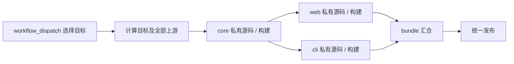

# Buildgraph

一个公开的 GitHub Actions 构建中心，连接多个私有源码仓库。用一份配置描述构建依赖，选择目标后通过 `workflow_dispatch` 执行整条上游链路，并在同一个仓库集中分发产物。

| 入口 | 用途 |
| --- | --- |
| [buildgraph.json](./buildgraph.json) | 可运行的分叉、并行、汇合示例 |
| [私有项目示例](./examples/private-projects.json) | GitHub App checkout、公共配置、加密传递、统一 Release |
| [配置参考](./docs/configuration.md) | 节点、认证、变量、产物和 CLI 的完整契约 |
| [架构与边界](./docs/architecture.md) | 编译、执行、失败传播和公开仓库的数据边界 |
| [复用 Action / JS 库](./docs/reuse.md) | 在其他公开 build repo 中使用本项目 |



每个节点生成一个原生 Actions job，依赖成为 `needs`。共享依赖只构建一次，没有相互依赖的分支可以并行。源码仓库不需要安装工作流，也不需要对应的公开 distribution repo。构建在这个公开仓库中运行。

## 运行示例

需要 Node.js 24+、GitHub CLI，以及一个启用 Actions 的公开仓库。可以 fork 本仓库，或把它设置成自己的构建中心。

```sh
npm ci --ignore-scripts
npm run build
npm run check

# 仅首次设置：随机生成传递中间产物的密钥，直接写入当前仓库 secret。
# 不要对仍需解密历史 artifact 的仓库随意重复执行此命令。
node bin/buildgraph.js keygen | gh secret set BUILDGRAPH_ARTIFACT_KEY

gh workflow run build.yml -f target=bundle
```

也可以在 Actions → **Buildgraph demo** → **Run workflow** 中选择目标。默认的 `bundle` 会运行 `core → [web, cli] → bundle`；`independent` 不会运行。`target=cli` 只运行 `core → cli`。多个目标用逗号分隔。

在运行摘要中查看选择结果和各节点的源码 commit。最终 `bundle` artifact 内的 `output.tar.gz` 含一个 HTML 文件和一个可运行的 Node CLI。中间 artifact 是加密文件，最终产物显式配置为公开。

```sh
# 只查看计划；不 checkout 私有源码，不执行构建。
gh workflow run build.yml -f target=web,cli -F plan_only=true
```

## 接入私有项目

编辑 `buildgraph.json`，参考 [private-projects.json](./examples/private-projects.json)。配置保存源码仓库名和构建步骤；凭证保存在这个公开 build repo 的 Settings → Secrets and variables → Actions。

推荐创建一个 GitHub App，给需要构建的源码仓库授予 **Contents: read**，在 build repo 中配置 `SOURCE_APP_CLIENT_ID` variable 和 `SOURCE_APP_PRIVATE_KEY` secret。每个 source job 会生成只覆盖该源码仓库的安装令牌。另一种方式是使用仅具有所需仓库读取权限的 fine-grained PAT；字段见[认证配置](./docs/configuration.md#认证)。

每个节点把需要传给下游的文件写入 `$BUILDGRAPH_OUTPUT`。下游通过 `$BUILDGRAPH_INPUTS/<上游节点名>` 读取。声明 `output: {}` 会启用加密传递；`output: { "visibility": "public" }` 表示文件可以公开下载。未声明 `output` 的节点只提供执行顺序依赖。

修改图之后生成、提交工作流，再从默认分支发起构建：

```sh
npm run generate
git add buildgraph.json .github/workflows/build.yml
git commit -m "Configure build graph"
git push
gh workflow run build.yml -f target=app -f 'refs={"core":"<commit-sha>","app":"<commit-sha>"}'
```

`refs` 只覆盖被选中源码节点的 Git ref，不改变仓库地址或构建命令。使用 commit SHA 可以复现同一组源码。`publish` 节点可把不同项目的发布集中到本仓库的 Releases，使用项目名前缀区分版本；也可以在节点 steps 中部署到自己的服务。

## 开发

```sh
npm ci --ignore-scripts
npm run build       # 生成可直接 uses 的 Action bundle 和 JSON Schema
npm run generate    # 配置图 → Actions YAML
npm run check       # 图、产物传递、完整示例链路、生成文件一致性
actionlint -shellcheck=''
```

CI 在 Linux、macOS、Windows 上运行测试，并检查生成文件是否与源文件一致。官方 Action 版本固定在 [src/actions.js](./src/actions.js) 的 commit SHA；升级时修改该文件后重新生成工作流。

公开仓库的日志和元数据仍是公开的，加密 artifact 不会隐藏构建输出到日志里的源码或密钥。请阅读[公开数据与信任边界](./docs/architecture.md#公开数据与信任边界)，再接入真实项目。
