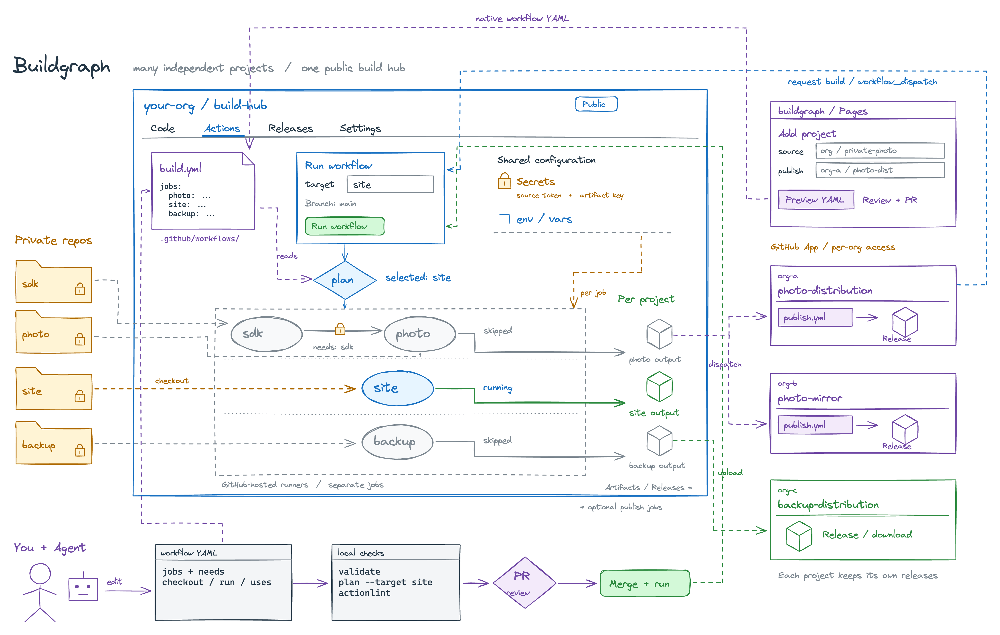

# Buildgraph

**用一个公开 GitHub 仓库，构建和分发许多互不相关的私有项目。**

一个网站、一个备份工具、一个照片应用，可以没有任何产品关系，也可以用完全不同的语言和版本号。它们的源码各自闭源，只共用这个公开的构建中心：统一放 workflows、可复用的配置，以及各项目自己的产物。产物可留在中央仓库，也可分发到不同组织自己的 distribution repo。

[打开接入向导](https://wibus-wee.github.io/buildgraph/) · [跨组织分发与双向触发](./docs/distribution.md)

[](./docs/diagrams/buildgraph.png)

[打开大图](./docs/diagrams/buildgraph.png) · [下载可编辑的 Excalidraw 源文件](./docs/diagrams/buildgraph.excalidraw)

图中蓝色大边界是**你的公开 build repo**，左侧文件夹是私有源码仓库。网站、备份工具、照片应用分开构建，也分开出产物；它们之间没有依赖箭头。只有照片应用确实依赖 sdk，所以那两个节点之间才有 `needs` 和带锁的产物传递。

上方选择 `target=site`，本次只构建网站，其他项目跳过。选择 `site,backup` 可以在一次运行中构建两个独立项目；它们不会因此被合并成一个产品。`plan` 读取同一份 YAML，只有发现真实的 `needs` 依赖时才补上必要的上游，GitHub 本身负责调度和失败传播。

图展示接入私有项目后的结构，产物出口按项目区分；使用 artifact、中央 Release，还是跨组织发布，由各自 workflow 决定。分发仓库也能反向请求中央构建。Pages 帮你准备同一份 YAML，审阅提交后才进入构建链。仓库自带 demo 使用本地示例代码，不需要你的真实源码，也不会创建 Release。

## 先跑通一次

在 GitHub 上 **Fork 本仓库**，例如命名为 `build-hub`，然后 clone 你的 fork。在 fork 的 Actions 页面启用 workflows。

```sh
git clone "https://github.com/YOUR_ACCOUNT/build-hub.git"
cd build-hub
gh repo set-default YOUR_ACCOUNT/build-hub
```

上述命令需要已登录的 GitHub CLI；`set-default` 将后续操作指向你的 fork。先运行不需要任何 secret 的独立演示：打开 **Actions → Buildgraph demo → Run workflow**，把 target 改成 `independent`，点击运行。也可以从当前目录触发：

```sh
gh workflow run build.yml -f target=independent
```

成功后，运行页面只会执行 plan 和 independent，其他 jobs 都被跳过。下载名称含 `independent` 的 artifact，解压外层 ZIP，再展开 `output.tar.gz`，里面是 `independent.txt`。这就是“选一个独立项目，只构建它”的完整过程。

只看计划、不执行构建时，在 demo 的表单勾选 `plan_only`。演示的其他目标用于验证依赖链，接入独立项目不需要使用它们。

## 换成你的私有项目

可以先用 [Pages 接入向导](https://wibus-wee.github.io/buildgraph/) 填写构建中心、源码仓库、命令和输出目录，预览后把 YAML 加入你的仓库。选择“保留加密产物”即可从独立项目开始；需要跨组织分发时再选择 Release 或远端 publish.yml。页面只准备普通 YAML，后续你和 Agent 直接编辑这个文件。

从 [independent-projects.yml](./examples/independent-projects.yml) 开始：一个 Node.js 网站 `site`，一个 Go 备份工具 `backup`。两个 job 都只依赖 planner，不依赖彼此，也不互相下载产物。

```sh
cp examples/independent-projects.yml .github/workflows/independent-projects.yml
```

把 `your-org/private-site`、`your-org/private-backup` 换成你的仓库，再修改各自的 runner、工具链、构建命令和输出目录。网站示例执行 `npm ci`、`npm run build`；备份工具执行 `go build`。项目可以拥有完全不同的构建方式。

中央仓库放在 `hub/`，私有源码放在 `source/`。保留这两个 checkout 目录的分离，`uses: ./hub/plan`、`./hub/upload`、`./hub/download` 才能找到本地 Action。

在中央仓库添加 `SOURCE_READ_TOKEN` secret，使用获准读取这些源码仓库的 fine-grained PAT，并授予所需仓库的 Contents: read 权限。也可换用 [GitHub App 安装令牌](./docs/configuration.md#私有源码与-ref)。源码仓库中的 secrets 不会自动传过来。

这个模板默认加密每个项目的产物，所以还需要首次创建 `BUILDGRAPH_ARTIFACT_KEY`。已有密钥时继续使用，不要重新生成；Fork 不会复制原仓库的 secrets：

```sh
openssl rand -hex 32 | gh secret set BUILDGRAPH_ARTIFACT_KEY
```

公共配置写在 workflow 顶层 `env`，跨 workflow 的值放中央仓库 Settings → Secrets and variables → Actions 的 Variables 中，用 `${{ vars.NAME }}` 引用。密钥只通过 `${{ secrets.NAME }}` 传入。

提交并推送新 workflow 到默认分支后，在 **Actions → Independent projects** 选择 `target=site`。它只 checkout 和构建网站；`target=backup` 只构建备份工具，`target=site,backup` 则分别构建两者。`site_ref`、`backup_ref` 各自决定源码版本，需要固定版本时填写 commit SHA。

只对允许公开的输出设置 `visibility: public`，并省略 upload 的 key。需要长期分发时，为对应项目添加发布 job，例如用 `site-v1.2.0`、`backup-v0.8.0` 区分同一仓库里的 Releases；这些版本互不绑定。独立项目模板本身不会创建 Release。

## 以后新增项目，改哪里？

**直接改 `.github/workflows/*.yml`。** 一个构建节点就是一个原生 job，依赖写在 `needs`，命令写在 `steps`。无需生成 workflow，也没有另一份构建清单需要同步。

一个没有项目依赖的新 job，只依赖 planner：

```yaml
desktop:
  needs: plan
  if: ${{ contains(fromJSON(needs.plan.outputs.selected), 'desktop') }}
  runs-on: ubuntu-latest
```

这里的 `needs: plan` 只是在等目标选择结果，不代表依赖另一个产品。`if` 控制该 job 是否属于本次选择。复制 job 时，条件中的 `'desktop'` 必须与新 job 的 ID 一致。

`plan` 选出目标及必要上游，`upload` 上传该项目的输出目录，`download` 恢复明确指定的产物；独立项目通常只用 plan 和 upload。需要跨 workflow 时，`dispatch` 触发对方的原生 workflow，并可等待结果。

只有真实依赖才增加项目间的边。例如 app 需要 core 的构建结果，才写 `needs: [plan, core]`，再通过 artifact ID 显式 download；仅写 needs 不会自动传文件。[依赖项目示例](./examples/private-projects.yml)展示了 `core → app → publish`。选择 publish 会公开发布 app，需要先配置 production environment；不要把这个目标当作所有项目的统一终点。

目录、权限、源码 ref、共享变量和发布步骤仍由原生 Actions YAML 管理。所有 input 的精确定义见[工作流接入](./docs/configuration.md)；已有自己的 build repo 时，可以[直接引用这些 Action](./docs/reuse.md)，不必 Fork。

项目多了，可以在同一个 build repo 里按项目或分组拆成多个 workflow。共享仓库不等于必须维护一张巨大的图：planner 只选择它所读取的那份 workflow 中的 jobs，`needs` 也只连接同一 workflow 内的节点。

## 分发到不同组织

跨组织分发从 [project-backup.yml](./examples/project-backup.yml) 的直接 Release 或 [project-photo.yml](./examples/project-photo.yml) 的远端发布开始；两者默认只 build，选择 deliver 才分发。在分发仓库安装 [request-build.yml](./examples/request-build.yml) 和 [publish.yml](./examples/publish.yml)，可从那里请求中央构建再接回结果。[接入步骤](./docs/distribution.md)说明各文件位置、App 授权、来源校验和重跑行为。

## 让 Agent 帮你维护

把 Agent 的工作目录设为**中央 build repo**，让它先读 [AGENTS.md](./AGENTS.md)。你提供项目仓库、依赖、源码 ref、构建命令、输出目录和是否允许公开发布，它就能修改同一份 YAML。图下方的路径是日常维护过程：改 workflow → 本地检查 → 审阅 diff → 提交并运行。

可以把下面这段任务交给 Agent，再换成你的实际信息：

> 在这个 build repo 接入独立项目 `your-org/private-desktop`，job ID 为 `desktop`，不依赖现有项目。新增 dispatch 输入 `desktop_ref`，默认 main；使用现有 `SOURCE_READ_TOKEN` 和产物密钥。源码放 `source/`，执行 `npm ci && npm run build`，上传 `source/dist`，产物保持加密。先读 AGENTS.md 和实际 workflow。保持原生 jobs/needs/steps，不新建配置格式。验证选择 desktop 时只构建 desktop，现有目标不会带上它。报告修改文件、需要配置的 secret 名称和验证结果。本次不要触发公开发布。

日常新增节点、修改依赖、修复构建失败的具体流程，放在 [Agent 维护指南](./docs/maintenance.md)。它区分了“改你的构建链”和“改 Buildgraph 工具实现”：前者通常只改 YAML，后者才需要重新打包 `dist/`。维护指南也说明了怎样更新这张 Excalidraw 图。

公开仓库的 workflow、运行记录和日志仍然公开；加密 artifact 只保护其中的文件内容。不要把打印源码、打包整个 checkout 目录或输出 secret 的步骤交给构建链。进一步的运行与信任边界见[架构说明](./docs/architecture.md#公开数据与信任边界)。
