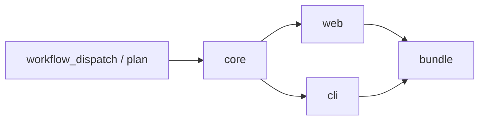

# Buildgraph

一个公开的 GitHub Actions 构建中心，连接多个私有源码仓库。直接用原生 Actions YAML 的 `jobs`、`needs` 和 `steps` 描述构建拓扑，`workflow_dispatch` 选择目标后执行它及其上游链路。

| 入口 | 用途 |
| --- | --- |
| [.github/workflows/build.yml](./.github/workflows/build.yml) | 直接编辑的构建图：core → web / cli → bundle |
| [私有项目工作流](./examples/private-projects.yml) | 私有源码 checkout、共享 env、产物传递、统一 Release |
| [工作流接入](./docs/configuration.md) | 原生 YAML 写法、选择目标、认证和 Action inputs |
| [架构与边界](./docs/architecture.md) | 目标筛选、失败传播、产物协议和公开数据边界 |
| [复用指南](./docs/reuse.md) | 在现有工作流中 uses 本项目，或调用 JS 库 / CLI |



工作流 YAML 是构建定义的唯一来源。GitHub 执行 jobs，Buildgraph 的 planner 读取同一个 YAML 中的 `needs`，计算所选目标的上游集合。构建命令、runner、矩阵、权限、secrets、env 和发布步骤都按标准 Actions 写法维护。修改 YAML 后提交即可运行。

## 运行

本仓库的演示已配置产物密钥，直接在 Actions → **Buildgraph demo** → **Run workflow** 中选择目标，或使用 GitHub CLI：

```sh
gh workflow run build.yml -f target=bundle
gh workflow run build.yml -f target=cli
gh workflow run build.yml -f target=web,cli -F plan_only=true
```

`bundle` 运行 `core → [web, cli] → bundle`；`cli` 只运行 `core → cli`；`independent` 是独立目标。共享依赖只构建一次，分支可以并行。`plan_only=true` 只显示计划。

最终 bundle artifact 中的 `output.tar.gz` 包含 HTML 和可执行 Node CLI。中间产物以密文跨 job 传递，最终产物显式选择公开。

Fork 成自己的构建中心时，需要首次创建 `BUILDGRAPH_ARTIFACT_KEY` secret。已有仓库不要随意替换密钥，否则无法恢复仍需使用的历史产物：

```sh
openssl rand -hex 32 | gh secret set BUILDGRAPH_ARTIFACT_KEY
```

## 编辑构建链

直接修改 [.github/workflows/build.yml](./.github/workflows/build.yml)。每个参与选择的 job 声明真实依赖，并使用 planner 的选择结果作为条件：

```yaml
app:
  needs: [plan, core]
  if: ${{ contains(fromJSON(needs.plan.outputs.selected), 'app') }}
  runs-on: ubuntu-latest
  steps:
    - uses: actions/checkout@3d3c42e5aac5ba805825da76410c181273ba90b1
      with:
        repository: your-org/private-app
        ref: ${{ inputs.app_ref }}
        token: ${{ secrets.SOURCE_READ_TOKEN }}
        persist-credentials: false
    - run: npm ci
    - run: npm run build
```

完整的下载上游产物、准备工作区、构建和发布写法在[私有项目工作流](./examples/private-projects.yml)中。通用配置放顶层 `env` 或仓库 variables，通用步骤可以用 YAML anchors、composite actions 或 reusable workflows 复用。

源码仓库不需要安装工作流。所有构建在中央公开 repo 执行，多个项目可以用不同 tag 前缀发布到同一个仓库的 Releases。

## 开发辅助库

只有修改 Buildgraph 本身的 JS 实现时才需要重新打包 Action；编辑工作流不需要构建工具：

```sh
npm ci --ignore-scripts
npm run build
npm run check
actionlint -shellcheck='' .github/workflows/*.yml examples/private-projects.yml
```

CI 在 Linux、macOS、Windows 上验证 planner 和产物传递，并检查提交的 Action bundle。第三方 Action 的固定版本直接写在相应 YAML 中。

公开 repo 的工作流、元数据和日志仍可公开读取；加密 artifact 只保护其中的文件内容。真实项目接入前请确认[信任边界](./docs/architecture.md#公开数据与信任边界)。
